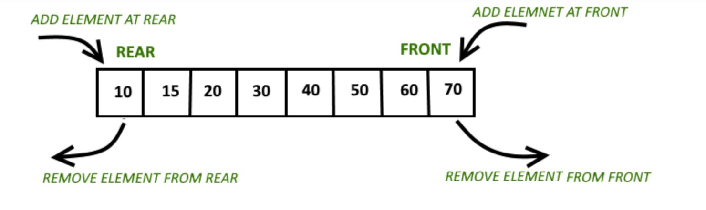

# IMPORTANT FACTS

## **IMPORTS**

- `from collections import Counter`
   - If you use this as `counter = Counter(<list_of_int>)` it returns a dictionary with the values in the list as keys and its frequency in the list as values
- `from collections import defaultdict`
   - Details under `Dictionary/Hashmaps` section

- `from collections import deque`
   - If you want flexibility to pop from and append to left as well as right side of the list in constant time, then use this data structure

## **IMPORTANT IN-BUILT FUNCTIONS**
- `ord()` : Gives the ASCII value of the character. Eg: ord('a')

## IMPORTANT TECHNIQUES TO DEAL WITH DS AND REDUCE COMPLEXITIES
### **TWO POINTER TECHNIQUE/PATTERN**
- Can be used for arrays, string, and some linked list questions
- Have two pointers (eg: left & right pointers) run through your string, linked list or arrays
- Usually reduces memory usage
- Refer to this video to understand in detail: https://www.youtube.com/watch?v=-gjxg6Pln50
   

### **SLIDING WINDOW TECHNIQUE**
- Prevents repetitive work and so improves time complexity
- **How to identify that we need to use this technique?**
   - It will usually be a string or an array question
   - Sliding window is always continuous window (there won't be a case where half of your window is on left of the array and half on right)
   - The question will involve `substring` or `subarray`, will give an integer `k` which will be window size, and will be asking for the largest or the smallest value
   - Sometimes they might ask us to find the window size
- **Two types of sliding windows:**

   1. `Fixed size` -> Window size will be given in the question and will remain the same throughout
     - Eg: Find the largest sum from the subarrays of size 3 from the given array
   2. `Variable size` -> Window size will change based on the given condition and the question will mostly ask to find the largest or the smalles window size
      - Eg: Find the largest subarray whose sum equals to 5
- Refer to this video to understand in detail:
https://youtu.be/EHCGAZBbB88?si=sWUAABnN6D9YiitL
  

### **RECURSION**
- A function calling itself
- Whenever there is a choice or decision to make in a problem, it is most likely a problem to solved using recursion

## DATA STRUCTURES
### **LIST**
- The search is of O(n) time complexity
- The search with index is O(1) time complexity
- a.sort() function does not assign value to variables. It modifies the original list and sort it:
  ```shell
  >>> a = [3,2,1]
  >>> sort_func_a = a.sort()
  >>> a
  [1, 2, 3]
  >>> sort_func_a
  ```
- Use sorted() function to assign sorted list to a variable and not modify the original list:
  ```shell
  >>> a = [3,2,1]
  >>> sort_func_a = sorted(a)
  >>> sort_func_a
  [1, 2, 3]
  ```


### **DICTIONARY/HASHMAPS**
- Dictionary `cannot` have anything that it `mutable as its key`
- defaultdict (from collections import defaultdict) are almost same except for the fact that defaultdict never raises a KeyError. It provides a default value for the key that does not exists. By default, all keys in dictionaries need to be initialized. In order to avoid that, use `Defaultdict` to have keys initialized by default
- The search is O(1) time complexity
- Retreiving data:
   - hashmap.keys() - returns all of the keys from the dictionary in form of a list
   - hashmap.values() - returns all of the values from the dictionary in form of a list
   - hashmap.items() - returns a list of the all key-value pairs as tuples

### **DEQUE**
- Based on list only but allows us to remove elements from and appened elements to the left and right of the list in constant time
- Functions:
   - deque.append() - insert value in its argument to the right end --> O(1) time complexity & space complexity
   - deque.appendleft() - insert value in its argument to the left end --> O(1) time complexity & space complexity
   - deque.pop() - delete an argument from the right end --> O(1) time complexity & space complexity
   - deque.popleft() - delete an argument from the left end --> O(1) time complexity & space complexity
   - deque.extend(iterable) - add multiple values at the right end --> O(K) time complexity & space complexity
   - deque.extendleft(iterable) - add multiple values at the left end --> O(K) time complexity & space complexity

   
  For more deque functions, do `help(deque)` on your python interpreter or read through [this](https://www.geeksforgeeks.org/deque-in-python/):
     ```shell
     >>> from collections import deque
     >>> help(deque)
     ```

### **STACK**
- Stores items in `Last in First Out` or `First In Last Out` manner
- Insertion and deletion happen on one end only and are called push and pop respectively
- Functions:
   - empty() - returns whether the stack is empty --> O(1) time complexity
   - size() - returns the size of the stack - O(1) time complexity
   - top() / peek() - returns a reference to the topmost element of the stack --> O(1) time complexity
   - push(a) - inserts element `a` at the top of the stack --> O(1) time complexity
   - pop() - deletes the topmost element of the stack --> O(1) time complexity
- Can be implemented using following ways:
   1. list
       - Instead of `push()`, you use `append() to add elements` at the top
       - `pop()` can be used to remove elements from top
       - The downside is that it can run into speed issues as it grows
   2. Collections.deque
       - Offers quicker append and pop operations from both the ends in O(1) time complexity
       - Use `append()` and `pop()` when implementing stack using deque()
   3. queue.LifoQueue
       - Use `put()` function for insertion and `get()` for deletion
       - Functions:
         - maxsize – number of items allowed in the queue
         - empty() – return True if the queue is empty, False otherwise
         - full() – return True if there are maxsize items in the queue. If the queue was initialized with maxsize=0 (the default), then full() never returns True
         - get() – remove and return an item from the queue. If the queue is empty, wait until an item is available
         - get_nowait() – return an item if one is immediately available, else raise QueueEmpty
         - put(item) – put an item into the queue. If the queue is full, wait until a free slot is available before adding the item
         - put_nowait(item) – put an item into the queue without blocking. If no free slot is immediately available, raise QueueFull
         - qsize() – return the number of items in the queue
   Read through [this](https://www.geeksforgeeks.org/stack-in-python/) to see examples