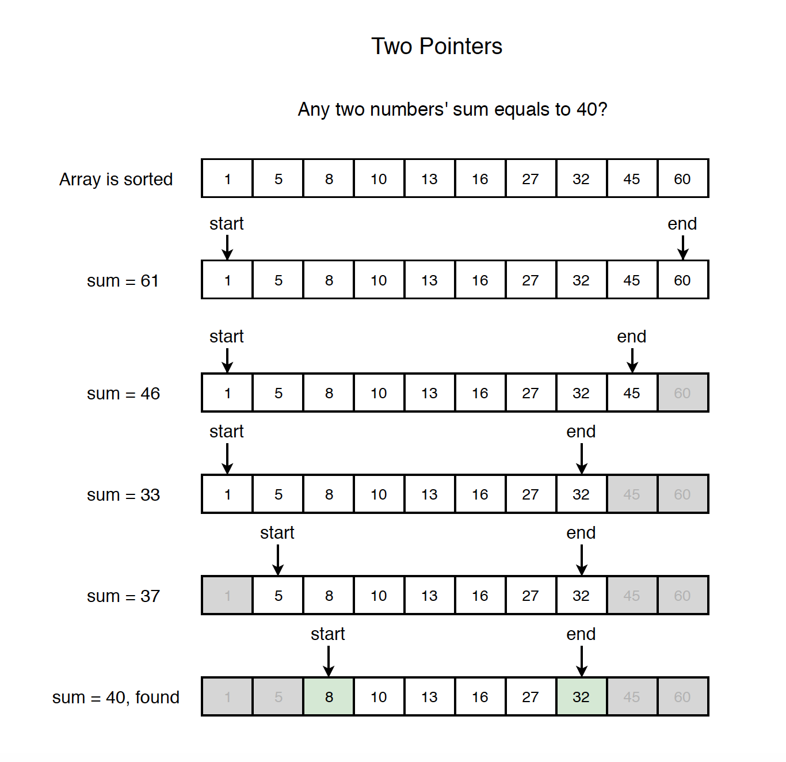
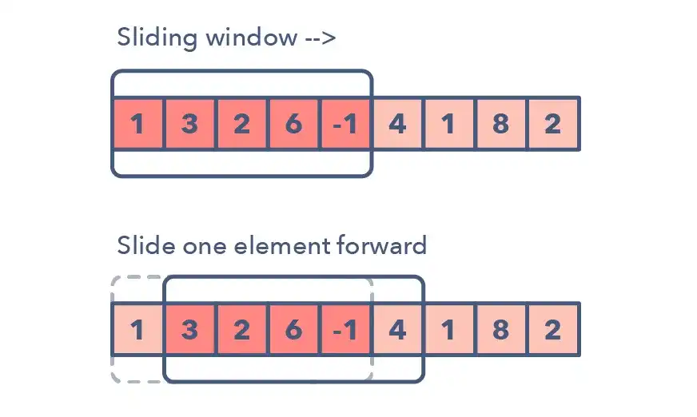

# IMPORTANT FACTS

## **IMPORTS**

- `from collections import Counter`
   - If you use this as `counter = Counter(<list_of_int>)` it returns a dictionary with the values in the list as keys and its frequency in the list as values
- `from collections import defaultdict`
   - Details under `Dictionary/Hashmaps` section

## **IMPORTANT IN-BUILT FUNCTIONS**
- `ord()` : Gives the ASCII value of the character. Eg: ord('a')

## **LIST**
- The search is of O(n) time complexity
- The search with index is O(1) time complexity

## **DICTIONARY/HASHMAPS**
- Dictionary `cannot` have anything that it `mutable as its key`
- defaultdict (from collections import defaultdict) are almost same except for the fact that defaultdict never raises a KeyError. It provides a default value for the key that does not exists. By default, all keys in dictionaries need to be initialized. In order to avoid that, use `Defaultdict` to have keys initialized by default
- The search is O(1) time complexity
- Retreiving data:
   - hashmap.keys() - returns all of the keys from the dictionary in form of a list
   - hashmap.values() - returns all of the values from the dictionary in form of a list
   - hashmap.items() - returns a list of the all key-value pairs as tuples

## **TWO POINTER TECHNIQUE/PATTER**
- Can be used for arrays, string, and some linked list questions
- Have two pointers (eg: left & right pointers) run through your string, linked list or arrays
- Usually reduces memory usage
- Refer to this video to understand in detail: https://www.youtube.com/watch?v=-gjxg6Pln50
   

## **SLIDING WINDOW TECHNIQUE**
- Prevents repetitive work and so improves time complexity
- **How to identify that we need to use this technique?**
   - It will usually be a string or an array question
   - Sliding window is always continuous window (there won't be a case where half of your window is on left of the array and half on right)
   - The question will involve `substring` or `subarray`, will give an integer `k` which will be window size, and will be asking for the largest or the smallest value
   - Sometimes they might ask us to find the window size
- **Two types of sliding windows:**

   1. `Fixed size` -> Window size will be given in the question and will remain the same throughout
     - Eg: Find the largest sum from the subarrays of size 3 from the given array
   2. `Variable size` -> Window size will change based on the given condition and the question will mostly ask to find the largest or the smalles window size
      - Eg: Find the largest subarray whose sum equals to 5
- Refer to this video to understand in detail:
https://youtu.be/EHCGAZBbB88?si=sWUAABnN6D9YiitL
  

